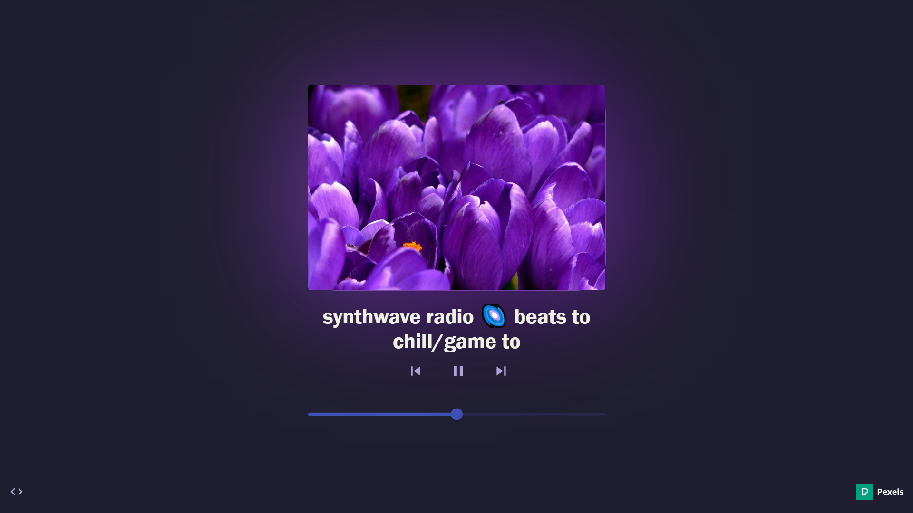
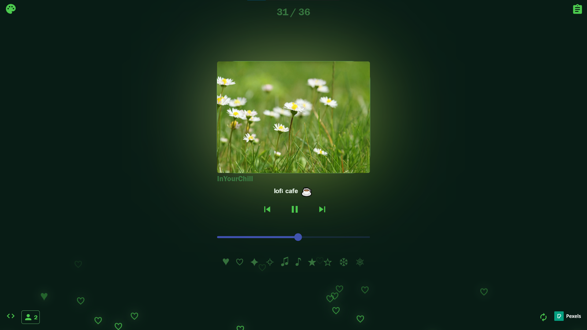

# 📼 Lofi Radio

Faz tempo que queria fazer algo assim... Um site com algumas estações de rádio 24/7 de puro **LOFI**! Aproveitem. 🎶

A primeira versão deste projeto foi feita em apenas **2 dias** — fruto do entusiasmo e vontade de criar algo próprio.  
Esse entusiasmo continua vivo, e novas atualizações estão a caminho! 🌱

---

## 📌 Última Atualização – Melhorias de Qualidade de Vida

A versão mais recente do site trouxe uma série de melhorias pensadas para tornar a experiência mais agradável e flexível, tanto para mim quanto para os usuários:

### 🔐 Modo ADM (Acesso Exclusivo)
- Criação de um painel administrativo oculto, acessível apenas por mim.
- Permite **adicionar** ou **remover** rádios sem necessidade de editar o código-fonte.

### 🎨 Personalização do Tema
- Os usuários agora podem:
  - Escolher **paletas de cores** para o site.
  - Selecionar diferentes **wallpapers de fundo**.

### 👥 Contador de Usuários Online
- Agora é possível visualizar **quantas pessoas estão no site em tempo real**.
- Tudo isso de forma **anônima**, sem necessidade de login.

### 😄 Emojis Interativos
- Emojis flutuantes que os usuários podem clicar.
- O emoji clicado é enviado ao banco de dados e reaparece no site como um **popup** visível a todos os usuários conectados.

### 📻 Contador de Rádios
- Um contador no topo da página indica o número total de rádios disponíveis.

### 📡 Efeito Sonoro ao Trocar de Rádio
- Ao trocar de estação, um **leve som de chiado** é reproduzido.
- Cria uma experiência mais **imersiva**, como se fosse uma rádio de verdade.

---

---

## 🚀 Última Atualização – Abril 2025

O projeto **Lofi Radio** recebeu mais uma grande atualização, recheada de melhorias que elevam ainda mais a experiência do usuário!  
Talvez essa seja a **última atualização oficial** — então aproveita que ficou massa demais! 🤯

### ✨ Novidades e Melhorias

- **📃 Listagem de Rádios Disponíveis**
  - Agora é possível visualizar todas as rádios ativas em tempo real, graças à integração com a **YouTube Data API v3**.

- **🎚️ Cor na Barra de Volume**
  - A barra de volume agora respeita o tema escolhido!
  - Como o Angular Material não permitia essa personalização diretamente, reescrevi tudo com **CSS puro e coragem**.

- **🌗 Transição Suave entre Temas**
  - A troca de temas está muito mais fluida e com transições visuais suaves.
  - Removi essa funcionalidade da versão mobile para garantir **maior performance**.

- **🛠️ Painel do Administrador Aprimorado**
  - O modo ADM agora exibe informações detalhadas sobre o uso da API.
  - Caso ocorra um erro 403 (limite de cotas da API), os usuários são **automaticamente notificados**.

- **📡 Status das Rádios**
  - Se alguma rádio estiver fora do ar, o site informa em tempo real, evitando confusão.

- **👥 Contador de Usuários**
  - O contador de usuários online está mais **preciso, responsivo e eficiente**.

- **📦 Otimização da Estrutura dos Scripts**
  - Refatorei partes do código para melhorar a **performance, manutenção e legibilidade**.

---

---

Se curtir o projeto, não esqueça de deixar uma ⭐ aqui no repositório!  
Obrigado por ouvir! ☕🎧
