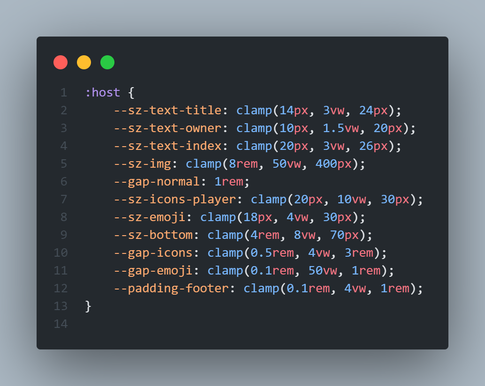

# 📼 Lofi Radio

Faz tempo que queria fazer algo assim. Uma site com algumas estações de rádio 24/7 de puro LOFI! Aproveitem.

A primeira versão foi feita em 2 dias e meu entusiasmo ainda existe. Pretendo atualizar mais em breve...

A última versão do site conta com atualização de qualidade de vida. Criei um modo ADM no qual somente eu tenho acesso, nele eu posso colocar e tirar qualquer rádio de meu interesse sem precisar abrir o código fonte;
Adicionei a possibilidade do usuário escolher o tema do site, como cores e wallpaper;
Agora é possível ver quantas pessoas estão no site ao vivo, sem precisar de login (utilizei uma técnica de registro anônimo);
Também há alguns emojis. Cada usuário pode clicar neles e dessa forma enviar um emoji para o banco de dados, lá será reenviado para o site e fará um popup do mesmo;
Foram adicionadas um contador de radios no topo da página para o usuário não se perder e, por fim, existe um som de chiado o trocar de rádio.

Um pouco de como eu escrevo em css:

Não se esqueça de deixar uma ⭐ nesse repositório!